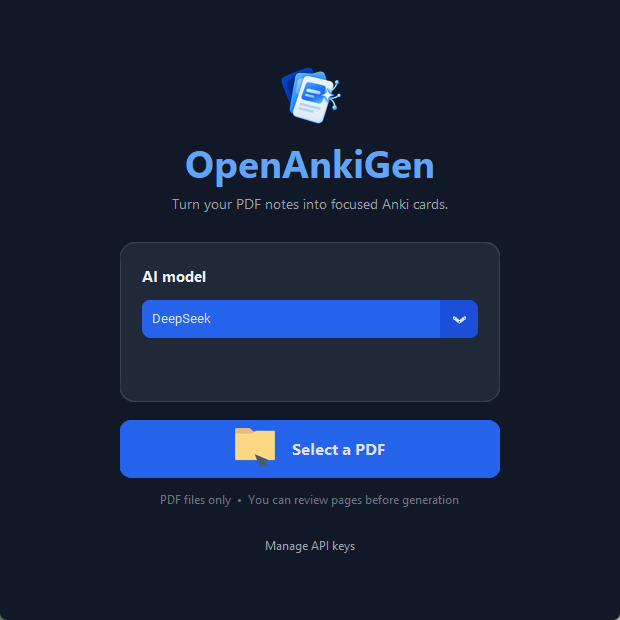
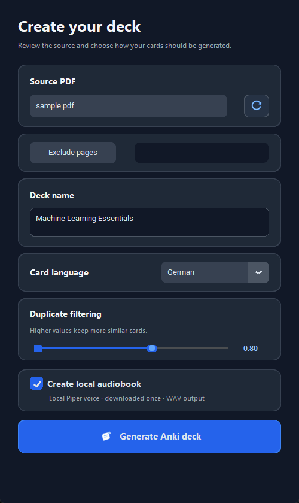
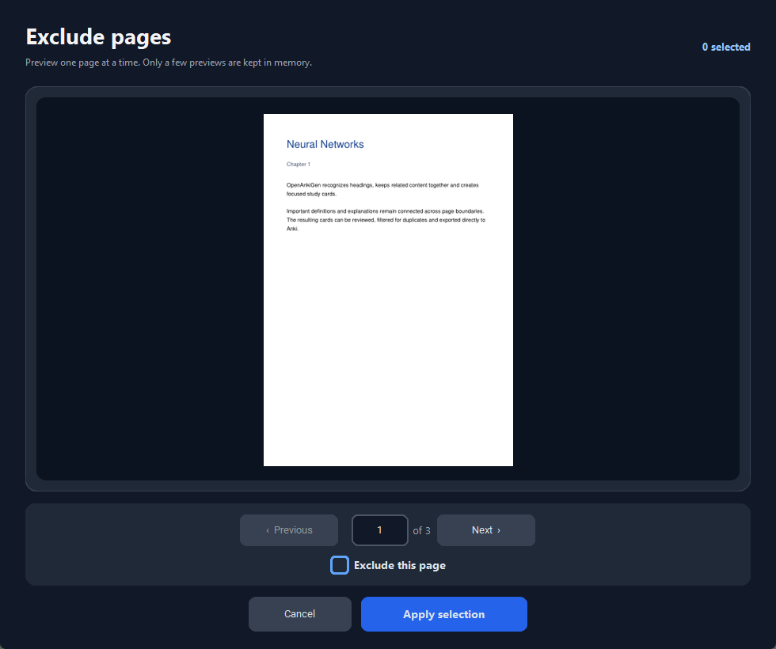
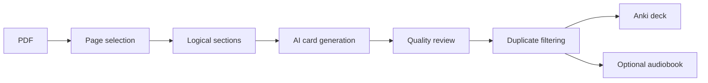

<p align="center">
  
</p>

<h1 align="center">OpenAnkiGen</h1>

<p align="center">
  Turn PDFs into focused Anki decks — with section-aware generation, duplicate filtering and an optional local audiobook.
</p>

<p align="center">
  <a href="https://github.com/Cuzimnero/OpenAnkiGen/releases/latest"><strong>Download for Windows</strong></a>
  ·
  <a href="#features">Features</a>
  ·
  <a href="#development">Development</a>
</p>

---

## A focused PDF-to-Anki workflow

OpenAnkiGen keeps the full workflow in one place: choose a PDF, exclude irrelevant pages, generate cards with your
preferred AI provider, remove semantic duplicates and export a ready-to-import Anki deck.

| Main window | Deck configuration |
|:---:|:---:|
|  |  |



## Features

- **Multiple AI providers:** DeepSeek, OpenAI, Claude or a local Ollama model.
- **Section-aware PDF processing:** Detects headings and keeps related content together across pages.
- **Direct Anki export:** Produces an `.apkg` file without requiring AnkiConnect.
- **Semantic duplicate filtering:** Adjustable embedding threshold for controlling card density.
- **Formula support:** Normalizes generated formulas to Anki MathJax syntax.
- **Page exclusion:** Fast, memory-bounded previews even for very large PDFs.
- **Local audiobook:** Piper voices read questions and answers with a ten-second thinking pause and a quiet clock tick.
- **Private local mode:** With Ollama and Piper, generation and speech can stay on your computer.

## Install on Windows

1. Open the [latest release](https://github.com/Cuzimnero/OpenAnkiGen/releases/latest).
2. Download `OpenAnkiGen-Setup.exe`.
3. Run the installer and launch OpenAnkiGen from the Start menu.
4. Add an API key or select a locally installed Ollama model.

Windows may display a SmartScreen warning until releases are code-signed.

## How it works



Large sections are split at natural paragraph boundaries with a small overlap. The model receives the section title and
source range as context, while cards remain clean and independent from page numbers.

## AI providers

| Provider | Use case | Data location |
|---|---|---|
| DeepSeek | Cost-effective cloud generation | Cloud API |
| OpenAI | Strong general-purpose generation | Cloud API |
| Claude | Long-form and structured material | Cloud API |
| Ollama | Private, offline-capable generation | Local computer |

API keys are stored locally in the installation directory and are never included in builds or releases.

## Local audiobook

The optional audiobook uses project-local Piper ONNX voices. Mathematical expressions are removed from narration.
After every question, listeners receive ten seconds to think while a subtle clock ticks before the answer begins.

## Development

```powershell
git clone https://github.com/Cuzimnero/OpenAnkiGen.git
cd OpenAnkiGen
python -m venv .venv
.\.venv\Scripts\Activate.ps1
pip install -r requirements.txt
python .\src\ui\app.py
```

Run the tests with:

```powershell
python -m pytest -q
```

## Notes

- Windows is currently the supported desktop platform.
- AI output is non-deterministic and generated cards should be reviewed before studying.
- Local model performance depends on the selected Ollama model and available hardware.
- The installer is intentionally large because local embedding and speech models are bundled.
